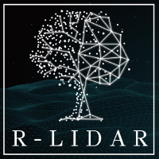

For this month's RUG, Nick will give an overview of **lidR and lasR**, and explore how you can use these to process and analyse LiDAR data to create spatial files like a DEM or CHM. We will follow with our usual drop-in, collaborative session.

 {style="margin-right:-0.2em;" width="87"}  

**When:** Thursday 30th of April 2026, 10 am - 12 pm

**Where:** in person (Central Library, St Lucia campus) or online (Zoom)

Sign up to the event [on StudentHub](https://studenthub.uq.edu.au/students/events/detail/6246549).

For more information, reach out to the UQ Library training team for more help: <a href="javascript:void(0);" onclick="copyEvent('copy')" id="copy" title="Click to copy email address">training\@library.uq.edu.au</a>